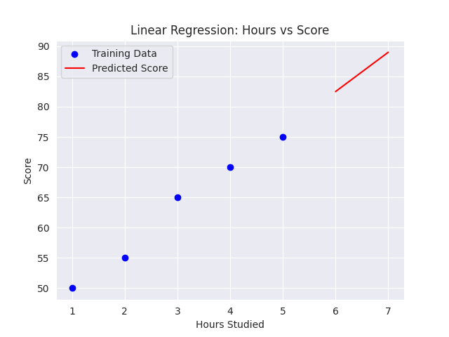

# Mini project: Linear Regression Model



## Problem 1: Linear Regression Model

This project includes a linear regression model for predicting scores based on the number of hours studied.

### Project Overview
This model uses simple linear regression to predict student scores based on study hours. The model was trained on a small dataset of hours and scores, and then used to predict scores for new inputs.

### Code Outline
1. **Data Preparation**: Training and test datasets are created using hours and score data.
2. **Model Training**: The model is trained using the `LinearRegression` class from `sklearn`.
3. **Prediction**: The model predicts scores for test inputs and computes prediction errors.
4. **Visualization**: A scatter plot shows the relationship between hours studied and predicted scores.

### Running the Code
1. Import the necessary libraries:
    ```python
    import numpy as np
    from sklearn.linear_model import LinearRegression
    ```

2. Train the model and make predictions:
    ```python
    model = LinearRegression()
    model.fit(hours_train, score_train)
    test_Ys = model.predict(hours_test)
    ```

3. Plot results:
    ```python
    def plot_linear_regression():
        plt.scatter(hours_train, score_train, color='blue', label='Training Data')
        plt.plot(hours_test, test_Ys, color='red', label='Predicted Score')
        plt.xlabel('Hours Studied')
        plt.ylabel('Score')
        plt.legend()
        plt.title('Linear Regression: Hours vs Score')
        plt.savefig('images/linear_regression.png')
        plt.show()
    plot_linear_regression()
    ```

### Requirements
- `numpy`
- `scikit-learn`
- `matplotlib`

### Results
This project provides a basic implementation of a linear regression model for predicting test scores. Predicted scores and prediction errors are printed, and the final plot is saved in the `images` directory.

---

